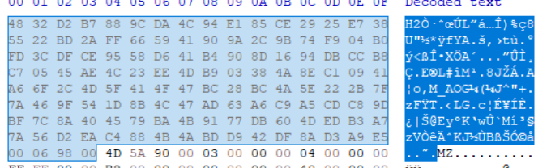

# SimpleExtractor

SimpleExtractor is an extractor for .spmod mod files, used in Simple Planes, written in Python.

> SimpleRockets2 (aka Juno: New Origins) support is also planned

The code is based on reverse-engineered game .dll's from Simple Planes

**Disclaimer: For Research Purposes Only**

The information and materials provided in this document are intended for research purposes only. Any use of the content for commercial, educational, or any other purposes is at your own risk. The authors do not endorse or promote any unethical or illegal activities.

## Usage

```
$ python main.py mod.spmod
```

Will extract assetBundles for platforms, included in the mod

## Possible issues

Since the unpacker is in its early version, it may have some issues, including, but not limited to:

- The unpacker may not be ready to unpack old mods
- The unpacker may not be able to unpack "bundled" mods

In case of getting an error, reach us out in issues, including mod you were trying to unpack

### Note on reverse-engineering assemblies from mods

After extracting any .dll files with any desired extractor of assetBundles (for example UABE), you may sometimes notice that you can't open those via any C# disassembler. You may already have noticed, that those are as TextAssets

- To properly import library, use any possible HEX editor and remove first 132 bytes (0-83 blocks, length 84, if you are using HxD) of .txt file, and save it as dll
- - Those 132 bytes, are "header" which mark files as "assembly" for the game. You can find exact header numbers in main.py.
- Now dll should be importable




## `spmod` files format

Initially, when downloaded, the mod is in compressed state.

In such case, file consists of:

1. Header (`SimplePlanesCompressedModFileV001`)
2. Gzip data

When you import it into the game, game copies into the dir, runs unpacking function on dir, and scans all mods

After unpack, we get file consisting of:

1. Header (`SimplePlanesModHeaderV001`)
2. 8 bits of 64-bit signed integer, representing Windows assetBundle offset, for loading with `AssetBundle.LoadFromFile` function later. If the bundle isn't here, the number will be lower than or equal to 0.
3. Same 8 bits, but for MacOS assetBundle offset
4. 8 bits for Linux assetBundle offset
5. 8 bits for Android assetBundle offset
6. Bundles itself, defined by offsets

Notice, that Android is no longer supported as a platform, yet its saved in the format. [This is due to drop of 32-bit support.](https://www.simpleplanes.com/Blog/View/1056875/Update-1-9-High-Caliber)

iOS should've also had support of mods, and has a lot of mentions in ModTools dll's. However, the support is not avaliable.
